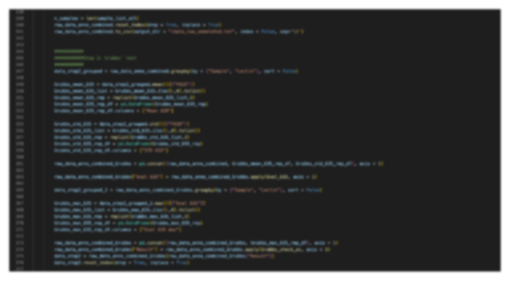

I am a senior bioinformatician.

I have a PhD in Chemistry (Chemical Biology) as well as a bachelor's degree in Pharmaceutical Sciences.

I write in my free time to share some of my thoughts on bioinformatics, biology, the biotechnology industry, among other topics.

I currently reside in [Edmonton](https://en.wikipedia.org/wiki/Edmonton), Canada.